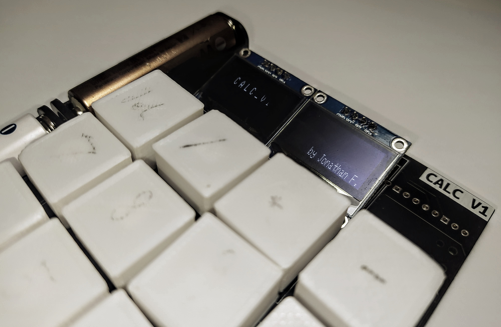
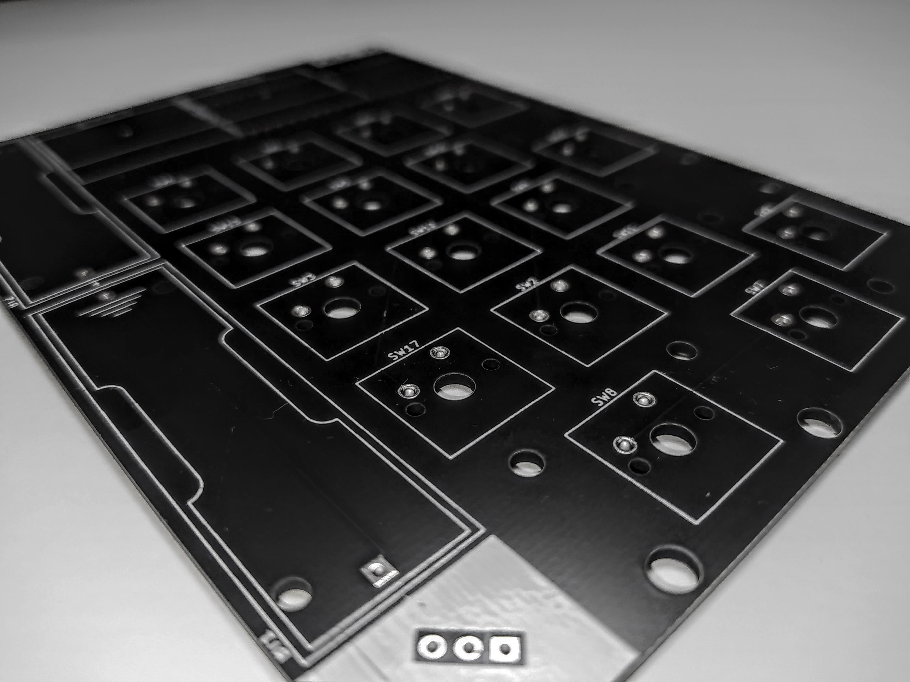

# Calc V1 🧮



## Information 📜
This is RP2040 (Raspberry Pi Pico) driven calculator using mechanical switches based on the MX-format.

This is my very first *real* physical and polished project and thus im very proud of it!

## PCB



The 2 sided PCB was designed in kicad and some rookie experience!
You can find the design files in the kicad folder and production in gerber.


## Installation 📀

Before installing, it is very important to flash **circuipy** on your Pico. You can download the newest version [here](https://circuitpython.org/board/raspberry_pi_pico/)

Now there are two options:

### Installer (Linux Only!):

1. Open a terminal and cd to your CIRCUITPY-drive
2. run ```git clone https://github.com/Jonathan357611/Calc-V1.git``` there
3. ... and now ```./installer.sh```. The installer will delete all unnecessary files from your Pico!
4. Done!